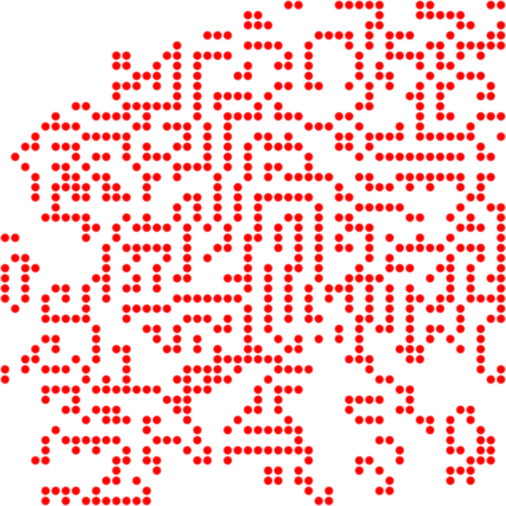

# Cellular Automaton Visualiser

Produces pretty pictures from Conway's Game of Life, after a certain number of generations with a set seed.

For example:

This is pretty basic and code is a bit messy. Not more than an hour and a bit of work.
