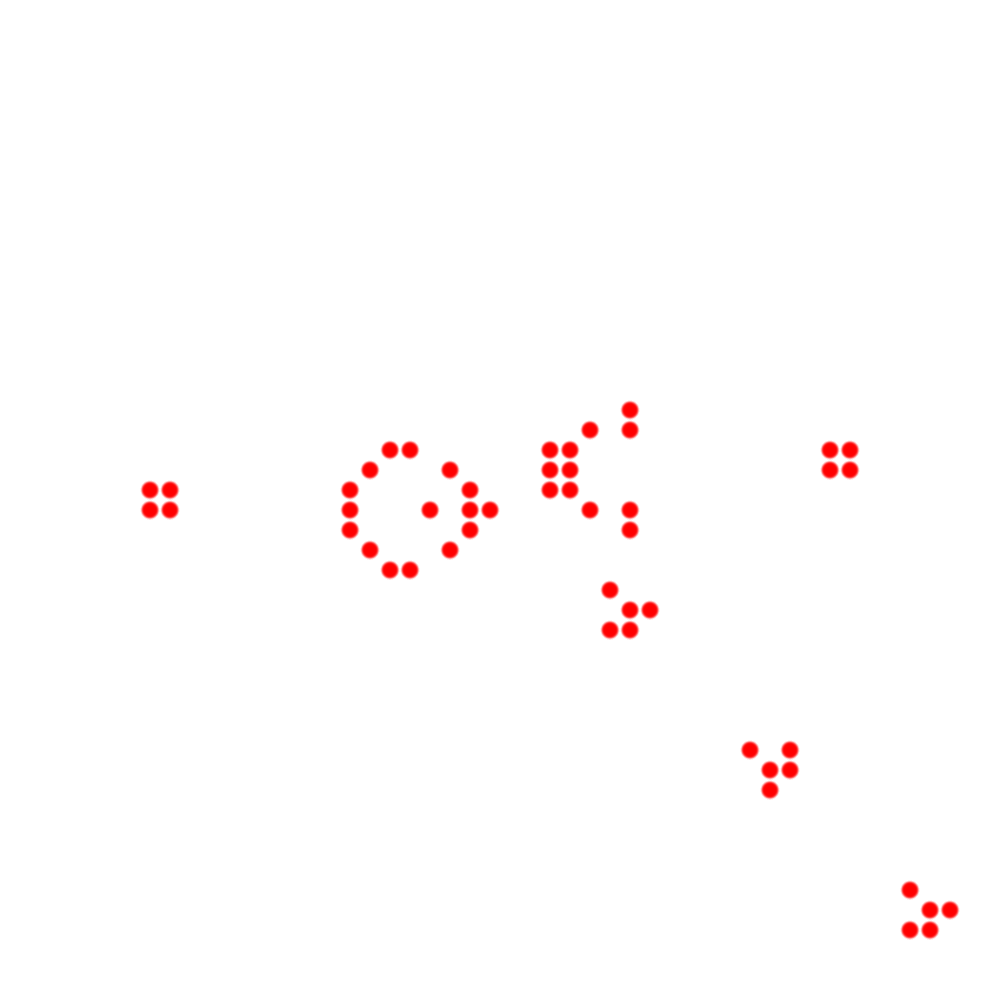

# Cellular Automaton Visualiser

Produces pretty pictures from Conway's Game of Life, after a certain number of generations with a set seed.

For example:

or:

(These images were all generated using test.py)

##TODO
- More shapes
- Prettier Outputs
- Animated GIFS
- More cellular automaton? That's a big one!
