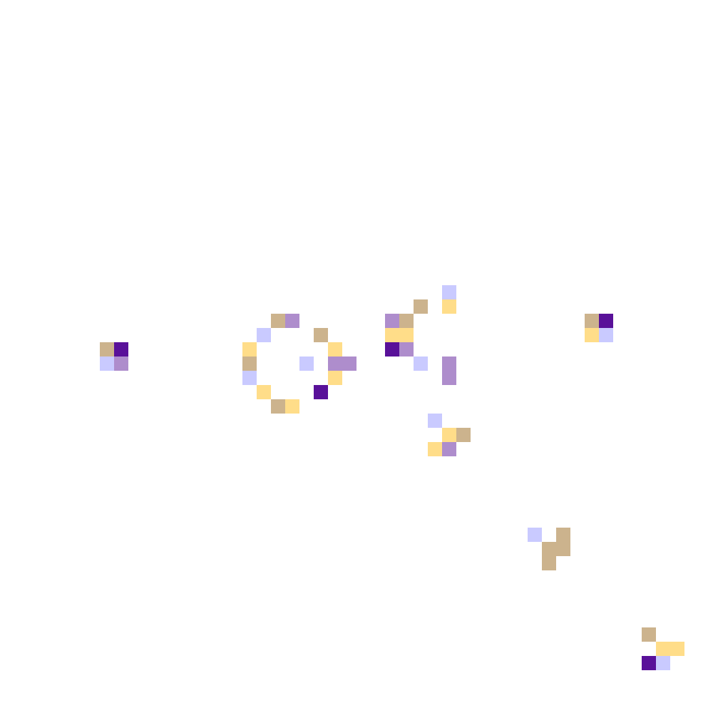

# Cellular Automaton Visualiser

Produces pretty pictures from Conway's Game of Life, after a certain number of generations with a set seed.

For example:

or:

(These images were both generated using test.py)

Tested with Python 3 and PIL on a machine running Ubuntu 14.04.4 LTS.
